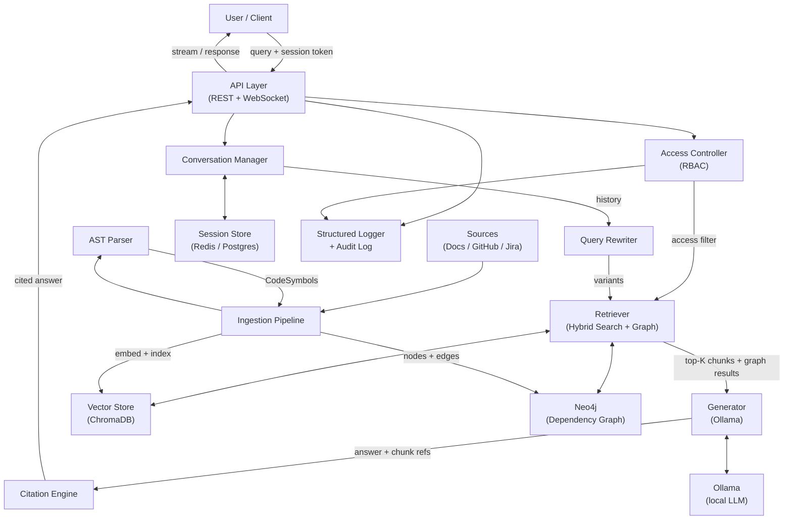
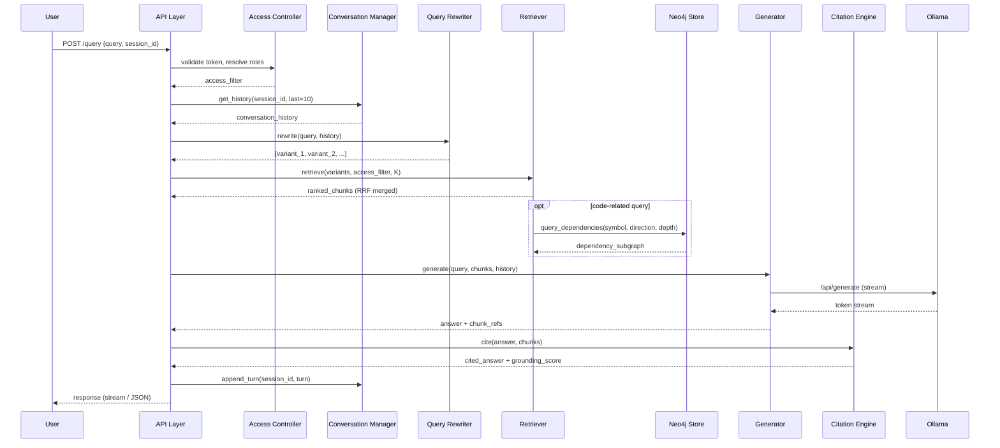

# Design Document: Enterprise RAG System

## Overview

The Enterprise RAG System is a locally-hosted Retrieval-Augmented Generation platform that enables employees to query internal knowledge sources — documentation, GitHub repositories, and Jira tickets — and receive grounded, cited answers. All LLM inference runs through a local Ollama instance, ensuring no enterprise data leaves the perimeter.

The system is composed of six primary processing stages that execute per query:

1. **Authentication & RBAC** — validate session token, resolve user roles, build access filter
2. **Conversational Memory** — load session history, provide last 10 turns as context
3. **Query Rewriting** — expand/clarify the query using conversation history, produce multiple variants
4. **Semantic Retrieval** — hybrid search (semantic + BM25) against the vector store, apply access filter, reciprocal rank fusion across variants
5. **Answer Generation** — Ollama LLM generates a grounded answer from top-K chunks
6. **Citation & Hallucination Mitigation** — map answer claims to chunks, compute grounding score, flag unverified claims

A separate background process handles **ingestion** — fetching, chunking, embedding, and indexing content from the three source types on a scheduled or triggered basis.

### Key Design Decisions

- **Local-only inference**: Ollama is the sole LLM backend. No external API fallback exists by design.
- **Access filter applied pre-retrieval**: RBAC filtering happens before scoring, not as a post-filter, to prevent information leakage through relevance scores.
- **Hybrid search by default**: BM25 + semantic similarity with configurable weighting gives better recall on technical terminology common in engineering docs and Jira tickets.
- **Streaming-first**: The generator streams tokens to the UI when the Ollama model supports it, reducing perceived latency.
- **Durable session storage**: Sessions survive application restarts; expiry is time-based (60 min inactivity), not process-lifecycle-based.

---

## Architecture



### Component Interaction for a Query



---

## Components and Interfaces

### API Layer

Exposes the external interface. Handles request routing, authentication header extraction, response streaming, and correlation ID assignment.

```
POST /query
  Body: { session_id: string, query: string }
  Headers: Authorization: Bearer <token>
  Response: { answer: string, citations: Citation[], grounding_score: float, warning?: string }
  Streaming: Server-Sent Events when Ollama supports streaming

GET /health
  Response: { status: "ok"|"degraded", components: ComponentStatus[], last_ingestion: Record<source_id, timestamp> }
  # ComponentStatus includes: ollama, chromadb, neo4j, session_store, and each source connector

POST /ingest
  Body: { source_id: string, full?: boolean }
  Response: { job_id: string }

DELETE /session/{session_id}
  Response: 204 No Content
```

### Access Controller

Maintains role-to-source and role-to-document-tag mappings. Produces a pre-retrieval filter expression.

```
resolve_roles(token: str) -> List[Role]
build_access_filter(roles: List[Role]) -> AccessFilter
validate_token(token: str) -> bool
update_role_permissions(role: Role, permissions: Permissions) -> None  # applied within 60s
```

`AccessFilter` is a predicate that can be passed directly to the vector store query as a metadata filter.

### Query Rewriter

Uses the Ollama LLM (a lightweight prompt) to produce query variants. Falls back to the original query on timeout (5s).

```
rewrite(query: str, history: List[Turn], max_variants: int = 3) -> List[str]
```

### Retriever

Executes hybrid search per variant, then merges via reciprocal rank fusion. For code-related queries, also queries Neo4j and merges graph results.

```
retrieve(
  variants: List[str],
  access_filter: AccessFilter,
  k: int = 10,
  semantic_weight: float = 0.7,
  threshold: float = 0.5
) -> List[ScoredChunk]
```

Internally:
1. For each variant: run semantic search + BM25 search against ChromaDB (metadata filter applied for RBAC)
2. Combine per-variant scores: `score = semantic_weight * sem_score + (1 - semantic_weight) * bm25_score`
3. Merge across variants using reciprocal rank fusion: `rrf_score(d) = Σ 1 / (k + rank_i(d))`
4. Filter out chunks below threshold
5. If query is code-related, call `GraphStore.query_dependencies(symbol, direction, depth)` and append graph-derived chunks to the result set
6. Return top-K by RRF score

### Generator

Wraps the Ollama `/api/generate` endpoint. Enforces context window limits by truncating lower-ranked chunks.

```
generate(
  query: str,
  chunks: List[ScoredChunk],
  history: List[Turn],
  stream: bool = True
) -> AsyncIterator[str] | str
```

Prompt template (simplified):
```
You are a helpful assistant. Answer the user's question using ONLY the context below.
For every factual claim, cite the chunk number in brackets, e.g. [1].
If the context does not contain sufficient information, say so explicitly.

Context:
[1] <chunk_1_text>
[2] <chunk_2_text>
...

Conversation history:
<last N turns>

Question: <rewritten_query>
```

### Citation Engine

Maps `[N]` references in the answer text to actual chunk metadata. Deduplicates by document URL.

```
cite(answer: str, chunks: List[ScoredChunk]) -> CitedAnswer
compute_grounding_score(answer: str, chunks: List[ScoredChunk]) -> float
flag_unverified_claims(answer: str, chunks: List[ScoredChunk]) -> str
```

### Conversation Manager

Manages session lifecycle and history persistence.

```
get_history(session_id: str, last: int = 10) -> List[Turn]
append_turn(session_id: str, turn: Turn) -> None
clear_session(session_id: str) -> None
expire_inactive_sessions(ttl_minutes: int = 60) -> None  # background task
```

### Ingestion Pipeline

Pluggable source connectors share a common interface:

```
class SourceConnector:
  fetch_all() -> Iterator[Document]
  fetch_incremental(since: datetime) -> Iterator[Document]

class IngestionPipeline:
  run(source_id: str, incremental: bool = True) -> JobResult
  chunk(doc: Document, size: int = 512, overlap: int = 64) -> List[Chunk]
  embed(chunks: List[Chunk]) -> List[EmbeddedChunk]
  index(chunks: List[EmbeddedChunk]) -> None
  index_graph(symbols: List[CodeSymbol]) -> None  # populates Neo4j
```

Connectors: `DocsConnector`, `GitHubConnector` (GitHub API), `JiraConnector` (Jira REST API).

The `GitHubConnector` ingestion path runs the `ASTParser` on each source file before chunking:
- Parseable files (`.py`, `.js`, `.ts`, `.java`, etc.) → `ASTParser.parse(file)` → `List[CodeSymbol]` → stored as chunks in ChromaDB + nodes/edges in Neo4j
- Non-parseable files (markdown, YAML, config, binary) → standard text chunking

### AST Parser

Extracts structured code symbols from source files. Uses Python's built-in `ast` module for `.py` files and `tree-sitter` for multi-language support.

```
class ASTParser:
  parse(file_path: str, content: str, language: str) -> List[CodeSymbol]
  supported_languages() -> List[str]
```

Each `CodeSymbol` produced carries richer metadata than a plain text chunk, enabling both semantic search and graph traversal.

### Neo4j Graph Store

Stores and queries the code Dependency_Graph. Uses the `neo4j` Python driver in bolt protocol mode.

```
class GraphStore:
  upsert_symbols(symbols: List[CodeSymbol]) -> None
  upsert_relationships(symbols: List[CodeSymbol]) -> None
  query_dependencies(
    symbol: str,
    direction: Literal["callers", "callees", "both"],
    depth: int = 2
  ) -> DependencyGraph
  health_check() -> ComponentStatus
```

Node labels: `File`, `Function`, `Class`, `Method`, `Module`
Relationship types: `CALLS`, `INHERITS`, `IMPORTS`, `DEFINED_IN`, `CONTAINS`

---

## Data Models

```python
@dataclass
class Role:
    name: str                          # e.g. "engineering", "hr"
    permitted_source_ids: List[str]
    permitted_tags: List[str]

@dataclass
class AccessFilter:
    permitted_source_ids: List[str]
    permitted_tags: List[str]

@dataclass
class Chunk:
    chunk_id: str                      # uuid
    source_type: str                   # "docs" | "github" | "jira"
    source_id: str
    document_title: str
    document_url: str
    text: str
    token_count: int
    permission_tags: List[str]         # roles that can access this chunk
    created_at: datetime
    source_modified_at: datetime

@dataclass
class EmbeddedChunk(Chunk):
    embedding: List[float]             # dense vector

@dataclass
class ScoredChunk(Chunk):
    relevance_score: float
    rrf_score: float

@dataclass
class CodeSymbol:
    symbol_id: str                     # uuid
    file_path: str
    symbol_name: str
    symbol_type: str                   # "function" | "class" | "method" | "module"
    docstring: Optional[str]
    source_code: str
    line_start: int
    line_end: int
    call_refs: List[str]               # names of symbols called by this symbol
    source_id: str
    permission_tags: List[str]

@dataclass
class DependencyGraph:
    nodes: List[Dict]                  # {id, label, name, file_path}
    edges: List[Dict]                  # {source, target, relationship}
    root_symbol: str
    direction: str                     # "callers" | "callees" | "both"
    depth: int

@dataclass
class Citation:
    number: int
    source_type: str
    document_title: str
    document_url: str
    excerpt: str                       # verbatim, up to 300 chars
    chunk_ids: List[str]               # merged if same URL

@dataclass
class GraphCitation:
    number: int
    source_node: str                   # symbol name
    relationship: str                  # e.g. "CALLS"
    target_node: str                   # symbol name
    file_path: str
    source_id: str

@dataclass
class CitedAnswer:
    answer_text: str                   # with inline [N] references
    citations: List[Citation]
    graph_citations: List[GraphCitation]
    grounding_score: float             # cited_claims / total_claims
    unverified_claims: List[str]       # claims with no chunk mapping
    low_confidence_warning: bool       # grounding_score < 0.7
    dependency_graph_unavailable: bool # True if Neo4j was unreachable

@dataclass
class Turn:
    role: str                          # "user" | "assistant"
    original_query: str
    rewritten_query: str
    answer: str
    timestamp: datetime

@dataclass
class Session:
    session_id: str
    user_id: str
    turns: List[Turn]
    created_at: datetime
    last_active_at: datetime           # used for 60-min expiry

@dataclass
class JobResult:
    job_id: str
    source_id: str
    status: str                        # "success" | "failed"
    chunks_indexed: int
    symbols_indexed: int               # CodeSymbols written to Neo4j
    completed_at: datetime
    error_message: Optional[str]

@dataclass
class ComponentStatus:
    name: str
    status: str                        # "ok" | "degraded" | "down"
    last_checked: datetime
    detail: Optional[str]
```

### Storage Backends

| Data | Store | Notes |
|------|-------|-------|
| Embedded chunks + metadata | ChromaDB (persistent mode) | Native metadata filtering used for RBAC access filter; single collection with `permission_tags` metadata field; `chromadb` Python client |
| Code dependency graph | Neo4j | Nodes: `File`, `Function`, `Class`, `Method`, `Module`; Relationships: `CALLS`, `INHERITS`, `IMPORTS`, `DEFINED_IN`, `CONTAINS`; queried via bolt protocol |
| Session history | Redis (primary) + Postgres (durable) | Redis for fast access, Postgres for restart durability |
| Role/permission mappings | Postgres | Updated in-memory cache with 60s TTL |
| Ingestion job log | Postgres | Append-only |
| Structured audit logs | Configurable backend (file, Elasticsearch, S3) | 90-day retention |


---

## Correctness Properties

*A property is a characteristic or behavior that should hold true across all valid executions of a system — essentially, a formal statement about what the system should do. Properties serve as the bridge between human-readable specifications and machine-verifiable correctness guarantees.*

### Property 1: Chunk metadata completeness

*For any* document ingested from any source type, every resulting chunk must have non-null values for `source_type`, `source_id`, `document_title`, `document_url`, and `permission_tags`.

**Validates: Requirements 1.6**

---

### Property 2: Chunking size invariant

*For any* document of arbitrary content and length, when chunked with a given `size` and `overlap`, every resulting chunk must have a token count in the range `[1, size]`, and consecutive chunks must share `overlap` tokens at their boundary.

**Validates: Requirements 1.2**

---

### Property 3: Incremental sync only fetches modified content

*For any* set of documents with associated modification timestamps and any sync cutoff timestamp `t`, an incremental sync must process exactly the documents whose `modified_at > t` and must not process documents with `modified_at <= t`.

**Validates: Requirements 1.3**

---

### Property 4: Ingestion job log completeness

*For any* ingestion job that completes (success or failure), the job log must contain a record with the correct `status`, `chunks_indexed` count, and a `completed_at` timestamp.

**Validates: Requirements 1.5**

---

### Property 5: Access filter soundness

*For any* user with any set of assigned roles, and any set of chunks with varying permission tags, the retriever must never return a chunk whose `permission_tags` do not intersect with the user's resolved roles.

**Validates: Requirements 2.2, 2.3, 4.2**

---

### Property 6: Query audit log completeness

*For any* query processed by the system, the emitted log entry must contain non-null values for `timestamp`, `user_id`, `session_id`, `original_query`, `rewritten_query`, `chunks_retrieved`, `grounding_score`, and `latency_ms`.

**Validates: Requirements 2.6, 10.1**

---

### Property 7: Query rewriter always produces at least one variant

*For any* non-empty query string, the Query_Rewriter must return a list containing at least one variant (which may be the original query in the fallback case).

**Validates: Requirements 3.1**

---

### Property 8: Reciprocal rank fusion correctness

*For any* collection of ranked document lists, a document appearing in more lists must receive a higher RRF score than a document appearing in fewer lists, all else being equal (same ranks within each list).

**Validates: Requirements 3.3**

---

### Property 9: Retrieval result ordering and size

*For any* query with a configured `K`, the retriever must return at most `K` chunks, and the returned chunks must be sorted by their final score in descending order.

**Validates: Requirements 4.1**

---

### Property 10: Hybrid score formula correctness

*For any* `(semantic_score, bm25_score, semantic_weight)` triple where `semantic_weight ∈ [0, 1]`, the combined score must equal `semantic_weight * semantic_score + (1 - semantic_weight) * bm25_score`.

**Validates: Requirements 4.3**

---

### Property 11: Generator prompt contains chunks in descending relevance order

*For any* list of scored chunks passed to the Generator, the constructed Ollama prompt must present the chunks in strictly descending order of `relevance_score`, with the highest-scored chunk appearing first.

**Validates: Requirements 5.1, 5.5**

---

### Property 12: Context window truncation preserves highest-ranked chunks

*For any* list of chunks whose total token count exceeds the configured context window limit, the Generator must truncate by removing the lowest-ranked chunks first, and the resulting prompt must fit within the context window limit.

**Validates: Requirements 8.4**

---

### Property 13: Citation-answer correspondence

*For any* generated answer containing inline references `[N]`, every `[N]` must correspond to a citation with that number in the citations list, and every citation in the list must be referenced at least once in the answer text.

**Validates: Requirements 6.1, 6.3**

---

### Property 14: Citation field completeness and excerpt length

*For any* citation produced by the Citation_Engine, the fields `source_type`, `document_title`, `document_url`, and `excerpt` must all be non-null, and `len(excerpt) <= 300`.

**Validates: Requirements 6.2**

---

### Property 15: Citation deduplication by URL

*For any* set of retrieved chunks where multiple chunks share the same `document_url`, the Citation_Engine must produce exactly one citation entry per unique `document_url`, merging excerpts from all contributing chunks.

**Validates: Requirements 6.5**

---

### Property 16: Invalid chunk references are removed and flagged

*For any* answer that contains a reference `[N]` where `N` does not correspond to any chunk in the retrieved set, the Citation_Engine must remove the unsupported claim from the final answer and include it in `unverified_claims`.

**Validates: Requirements 6.4, 9.2**

---

### Property 17: Session turn round-trip fidelity

*For any* sequence of turns appended to a session, retrieving the session history must return the turns in the same order with all fields (`role`, `original_query`, `rewritten_query`, `answer`, `timestamp`) preserved exactly.

**Validates: Requirements 7.1, 7.6**

---

### Property 18: Session history window

*For any* session containing `N` turns, calling `get_history(last=10)` must return exactly `min(N, 10)` turns, always returning the most recent turns.

**Validates: Requirements 7.2**

---

### Property 19: Session persistence across restarts

*For any* active session with turns stored to durable storage, after a simulated application restart, the session history must be fully recoverable with all turns intact.

**Validates: Requirements 7.4**

---

### Property 20: Grounding score formula correctness

*For any* answer with a known number of cited claims `c` and total claims `t` (where `t > 0`), the computed `grounding_score` must equal `c / t`.

**Validates: Requirements 9.3**

---

### Property 21: Low-confidence behavior is consistent

*For any* answer where `grounding_score < 0.7`, the response must have `low_confidence_warning = true` AND a corresponding log entry must be emitted for administrator review.

**Validates: Requirements 9.4, 9.5**

---

### Property 22: Access control audit log completeness

*For any* access control decision made by the system, the emitted log entry must contain non-null values for `timestamp`, `user_id`, `roles_evaluated`, `sources_filtered`, and `chunks_excluded`.

**Validates: Requirements 10.2**

---

### Property 23: Error log correlation

*For any* component error that occurs during query processing, the emitted error log entry must contain `severity`, `component_name`, `error_message`, and a `correlation_id` that matches the `correlation_id` of the originating query log entry.

**Validates: Requirements 10.4**

---

### Property 24: AST symbol extraction completeness

*For any* parseable source code file, every `CodeSymbol` extracted by the `ASTParser` must have non-null values for `symbol_name`, `symbol_type`, `file_path`, `line_start`, `line_end`, and `call_refs` (which may be an empty list but must be present).

**Validates: Requirements 1.7**

---

### Property 25: Dual-store ingestion consistency

*For any* list of `CodeSymbol` objects produced by the `ASTParser`, after running the ingestion pipeline, every symbol must be retrievable from ChromaDB by its `symbol_id` AND must exist as a node in Neo4j by its `symbol_name` and `file_path`.

**Validates: Requirements 1.8**

---

### Property 26: Neo4j graph edge validity (no orphaned edges)

*For any* set of `CodeSymbol` objects ingested into Neo4j, every `CALLS` edge in the resulting graph must reference a source node and a target node that both exist in the graph; no `CALLS` edge may reference a node that was not part of the ingested symbol set.

**Validates: Requirements 11.2, 11.7**

---

### Property 27: Dependency query direction correctness

*For any* dependency graph and any target symbol, querying with `direction="callers"` must return only symbols that have a `CALLS` edge pointing to the target, querying with `direction="callees"` must return only symbols that the target has a `CALLS` edge pointing to, and querying with `direction="both"` must return the union of callers and callees.

**Validates: Requirements 11.4**

---

### Property 28: Graph citation field completeness

*For any* `DependencyGraph` result incorporated into a generated answer, every graph-derived citation produced by the `Citation_Engine` must have non-null values for `source_node`, `relationship`, `target_node`, and `file_path`.

**Validates: Requirements 11.5**

---

## Error Handling

### Authentication Errors
- Expired or invalid session token → HTTP 401, no chunks or answer returned, no Ollama call made
- Missing Authorization header → HTTP 401

### Ingestion Errors
- Source connection failure → retry up to 3 times with exponential backoff (1s, 2s, 4s), then mark job as failed and log with source identifier
- Partial ingestion failure (some documents fail) → log per-document errors, continue with remaining documents, record partial success in job log

### Query Rewriter Timeout
- Rewriter exceeds 5s → fall back to original query, log timeout event with session and query identifiers, continue with retrieval

### Retrieval — No Results
- No chunks above relevance threshold → return empty set, Generator returns standardized "insufficient information" message, no Ollama call

### Ollama Unavailability
- Ollama unreachable → return HTTP 503 within 10 seconds, log error with component name and correlation ID, no external fallback

### Neo4j Unavailability
- Neo4j unreachable during query → fall back to vector-only retrieval, log degradation with component name and correlation ID, set `dependency_graph_unavailable: true` in response metadata
- Neo4j unreachable during ingestion → log error, mark graph indexing as failed in job log, continue with ChromaDB indexing (partial success)

### Generator Timeout
- Generation exceeds 30s → return HTTP 504 timeout error to user, log with correlation ID

### Context Window Overflow
- Combined chunk tokens exceed model limit → truncate lowest-ranked chunks until within limit, log truncation event with number of chunks removed

### Invalid Citation References
- Answer references non-existent chunk number → remove claim from answer, add to `unverified_claims`, log discrepancy

### All errors include:
- Structured log entry with `severity`, `component_name`, `error_message`, `correlation_id`
- Correlation ID links error to the originating query log entry
- No sensitive data (chunk content, user queries) in error messages at ERROR severity or above

---

## Testing Strategy

### Dual Testing Approach

Unit tests cover specific examples, edge cases, and error conditions. Property-based tests verify universal properties across all inputs. Both are necessary for comprehensive coverage.

### Property-Based Testing

**Library**: [Hypothesis](https://hypothesis.readthedocs.io/) (Python) — mature, well-documented, integrates with pytest.

**Configuration**: Each property test runs a minimum of 100 iterations (`@settings(max_examples=100)`).

**Tag format**: Each test is tagged with a comment:
```python
# Feature: enterprise-rag-system, Property N: <property_text>
```

Properties to implement as property-based tests (from the Correctness Properties section):

| Property | Test Focus | Key Generators |
|----------|-----------|----------------|
| 1 — Chunk metadata completeness | All chunk fields non-null after ingestion | `st.text()`, `st.lists()` for document content |
| 2 — Chunking size invariant | Chunk token counts within bounds | `st.text()`, `st.integers(min_value=64, max_value=2048)` for size |
| 3 — Incremental sync filter | Only modified docs processed | `st.lists(st.datetimes())` for timestamps |
| 4 — Ingestion job log completeness | Job log has all required fields | Random document sets |
| 5 — Access filter soundness | No unauthorized chunks returned | `st.lists(st.sampled_from(roles))`, random chunk permission tags |
| 6 — Query audit log completeness | Log entry has all required fields | Random query/user/session combos |
| 7 — Rewriter produces ≥1 variant | Non-empty variant list | `st.text(min_size=1)` for queries |
| 8 — RRF correctness | More-listed docs rank higher | `st.lists(st.lists(...))` for ranked lists |
| 9 — Retrieval ordering and size | Results sorted, count ≤ K | Random scored chunk sets |
| 10 — Hybrid score formula | Score equals formula | `st.floats(0, 1)` for scores and weights |
| 11 — Prompt chunk ordering | Chunks in descending score order in prompt | Random scored chunk lists |
| 12 — Context window truncation | Prompt fits limit, lowest-ranked removed | Random chunk lists with token counts |
| 13 — Citation-answer correspondence | Every [N] has a citation | Random answer strings with [N] refs |
| 14 — Citation field completeness | All fields present, excerpt ≤ 300 chars | Random chunk metadata |
| 15 — Citation deduplication | One citation per unique URL | Random chunks with overlapping URLs |
| 16 — Invalid refs removed and flagged | Bad [N] refs removed from answer | Random answers with out-of-range refs |
| 17 — Session turn round-trip | All turn fields preserved in order | Random turn sequences |
| 18 — Session history window | Returns min(N, 10) turns | `st.integers(min_value=0, max_value=50)` for N |
| 19 — Session persistence | History survives restart | Random session states |
| 20 — Grounding score formula | score = cited/total | `st.integers(min_value=0)` for claim counts |
| 21 — Low-confidence behavior | Warning + log when score < 0.7 | `st.floats(0, 1)` for grounding scores |
| 22 — Access control audit log | Log entry has all required fields | Random access decisions |
| 23 — Error log correlation | Error log has correlation_id matching query | Random error scenarios |
| 24 — AST symbol extraction completeness | All CodeSymbol fields non-null | Generated Python/JS source snippets with functions, classes, methods |
| 25 — Dual-store ingestion consistency | Every CodeSymbol in both ChromaDB and Neo4j | Random CodeSymbol lists |
| 26 — Neo4j graph edge validity | No CALLS edge references absent node | Random CodeSymbol lists with out-of-set call_refs |
| 27 — Dependency query direction correctness | callers/callees/both returns correct node sets | Known graph structures with generated symbol names |
| 28 — Graph citation field completeness | All GraphCitation fields non-null | Random DependencyGraph objects |

### Unit Tests

Focus on:
- Specific examples: retry behavior (1.4), token expiry rejection (2.4), rewriter timeout fallback (3.4), empty retrieval response (4.4), empty chunk set → no Ollama call (5.3), session clear (7.5)
- Prompt template structure: grounding instruction present (5.2, 9.1)
- Integration points: Ollama unavailability (8.2), streaming token delivery (8.5)

### Integration Tests

- Role permission update propagation within 60s (2.5)
- Ollama unavailability → error within 10s, no fallback (8.2)
- Generator timeout → 504 within 30s (5.4)
- Health check endpoint returns all component statuses including ChromaDB and Neo4j (10.3)
- Session expiry after 60 min inactivity (7.3)
- Neo4j unavailability during query → vector-only fallback, `dependency_graph_unavailable: true` in response (11.6)
- GitHub ingestion end-to-end: AST symbols appear in both ChromaDB and Neo4j after job completes (1.8)

### Smoke Tests

- All three source connector types instantiate correctly (1.1)
- Role mapping CRUD operations (2.1)
- Runtime Ollama config change takes effect (8.3)
- Log retention policy configured to ≥ 90 days (10.5)
- Neo4j node labels and relationship types are present in schema (11.1)
- ChromaDB collection is accessible and metadata filtering is functional
